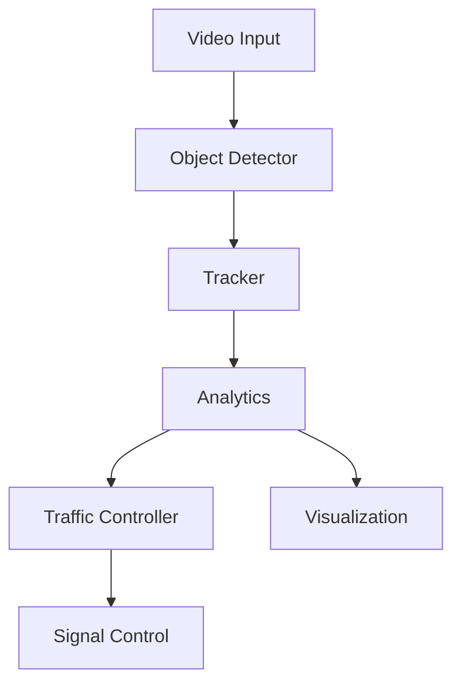

# Pedestrian Detection System Modules Documentation

## Overview
This document provides a detailed explanation of the core modules in the Pedestrian Detection System and how they work together to provide real-time pedestrian detection, tracking, and analytics.

## Core Modules

### 1. Object Detector (detector.py)
- **Purpose**: Handles real-time pedestrian detection using YOLO models
- **Key Features**:
  - Supports multiple YOLO versions (YOLOv8, YOLOv10)
  - Configurable confidence threshold
  - Multi-class detection (pedestrians, vehicles)
  - GPU acceleration support
- **Working Process**:
  1. Loads pre-trained YOLO model
  2. Processes video frames
  3. Returns bounding boxes, confidence scores, and class IDs
  4. Maintains detection statistics

### 2. Tracker Module (tracker.py)
- **Purpose**: Tracks detected pedestrians across video frames
- **Key Features**:
  - Multi-object tracking
  - Track ID assignment
  - Track age management
  - Track initialization criteria
- **Working Process**:
  1. Receives detections from detector
  2. Associates detections with existing tracks
  3. Updates track states
  4. Manages track lifecycle (creation/deletion)

### 3. Analytics Module (analytics.py)
- **Purpose**: Generates insights from detection and tracking data
- **Key Features**:
  - Real-time statistics
  - Heatmap generation
  - Zone-based monitoring
  - Dwell time analysis
- **Working Process**:
  1. Processes tracking data
  2. Updates metrics (counts, times)
  3. Generates visualizations
  4. Maintains historical data

### 4. Traffic Analyzer & Signal Controller
- **Purpose**: Manages traffic flow based on pedestrian detection
- **Components**:
  - Traffic analysis
  - Signal timing optimization
  - Emergency vehicle handling
- **Working Process**:
  1. Analyzes pedestrian patterns
  2. Adjusts signal timing
  3. Handles emergency scenarios

## Module Interactions



## Data Flow
1. Video frames are processed by the detector
2. Detections are passed to the tracker
3. Tracking info feeds into analytics
4. Analytics data drives traffic management
5. Results are visualized in web interface

## Performance Considerations
- GPU acceleration for detection
- Optimized tracking algorithms
- Efficient data structures
- Real-time processing capabilities

## Configuration
- Adjustable detection thresholds
- Customizable tracking parameters
- Configurable analytics zones
- Flexible visualization options

## Integration Example
```python
# Initialize modules
detector = ObjectDetector(model_path="yolov10x.pt", conf_thresh=0.3)
tracker = TrackerModule(max_age=20, n_init=3)
analytics = Analytics(frame_size=(height, width))

# Process video frame
detections = detector.detect(frame)
tracks = tracker.update(detections)
analytics.update(tracks)

# Get insights
results = analytics.get_analytics_data()
```

## Best Practices
1. Regular model updates
2. Proper error handling
3. Performance monitoring
4. Data validation
5. Regular maintenance

This documentation provides a comprehensive overview of the module system. For specific implementation details, refer to the individual module source files.